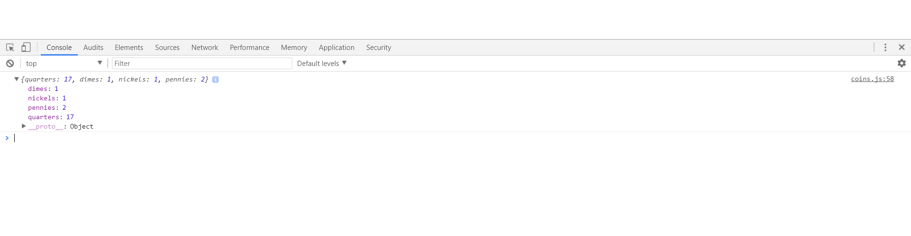

# Coins

### Project Summary

This project prompts the user to enter a dollar amount. The dollar amount will be converted into an object that shows how many coins of each denomination make up that dollar amount. It is logged in the console.

### Requirements

Write a program that will convert a dollar amount to the number of coins that make up the amount. Use the common American coins of quarters, dimes, nickels, and pennies.

### Screen Shots

### How do I run this project locally?

In order to run this project on your computer, please complete the following steps:
  1. Clone the project by clicking on the green "Clone or Download" button above.
  1. Run your terminal, type in git clone, then paste the information that was copied from github.
  1. Inside the project folder, type in http-server -c-1.
  1. Launch your internet browser and navigate to http://localhost:8080.